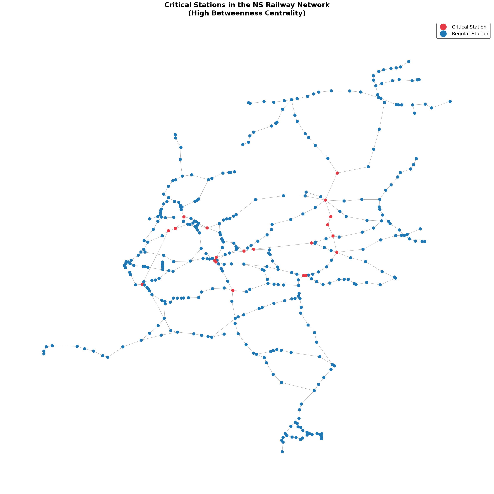

# ns-railway-robustness-analysis

Analyzing NS railway network robustness using graph theory to identify weak points and propose new connections to reduce disruption impact.



## Goal

Find the weakest points in the Dutch railway (NS) network and propose new connections that make it more robust to disruptions.

## Approach

1. Build the network as a graph (stations = nodes, routes = edges)
2. Find critical stations using degree and betweenness centrality
3. Simulate removing each critical station and measure the impact on travel distance
4. Propose new connections between stations that are geographically close but far apart by train
5. Re-test the network with the new connections and compare before/after

## Data

Place the following files in a `data/` folder in the project root:

| File | Description |
|---|---|
| `routes.csv` | Direct connections between stations, with distance |
| `stations-2023-09.csv` | Station codes, names, and geolocation |
| `disruptions-2023.csv` | Historical disruption records (loaded, not yet used in the analysis) |

## Usage

```bash
pip install numpy pandas geopy matplotlib networkx
```

Open `project_algorithms.ipynb` and run all cells in order.

## Results

- **397 stations**, **433 direct connections**
- Most stations have degree 2 — they sit on a single through-line with no redundant path
- A small set of hub stations (Zwolle, Utrecht Centraal, Amersfoort, Duivendrecht, among others) carries a disproportionate share of shortest paths
- ~20 stations (top 5% by betweenness) flagged as critical
- Zwolle stands out: removing it cuts off Friesland, Groningen, and Drenthe (~1.8 million people) with no efficient alternative route

## Proposed new connections

- Amersfoort Centraal ↔ Maarn
- Arnhem Centraal ↔ Apeldoorn
- Gouda ↔ Dordrecht
- Lelystad Centrum ↔ Heerenveen
- Apeldoorn ↔ Harderwijk
- Elst ↔ Zevenaar
- Zevenaar ↔ Rheden
- Harderwijk ↔ Lelystad Centrum
- Rhenen ↔ Kesteren
- Hoogeveen ↔ Emmen

## Limitations

- Doesn't model platform/track-level redundancy at a station
- Weighted by distance, not travel time or passenger volume
- New-connection distances are straight-line estimates, not real feasible routes

---

*Independent academic analysis. Not affiliated with or endorsed by NS.*
